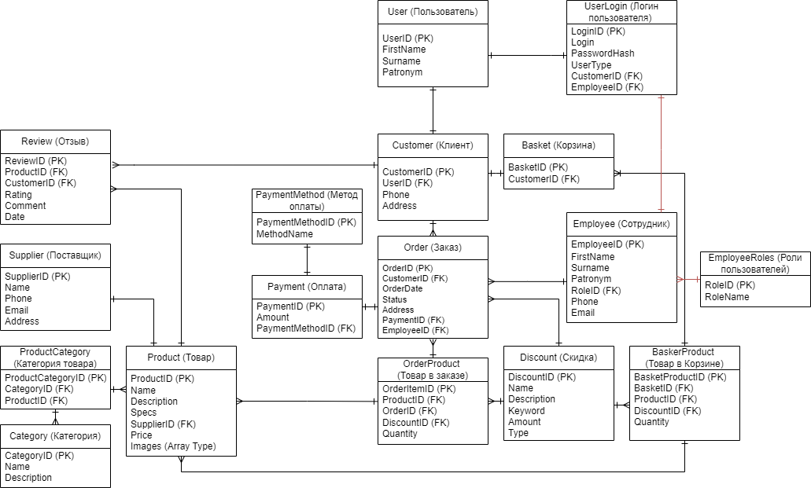

# Задание на Практическую Работу 1 — Модель базы данных для магазина техники

Данная модель описывает структуру базы данных интернет-магазина техники, включая сущности для клиентов, сотрудников, товаров, заказов и других ключевых аспектов.

## Сущности

### User (Пользователь)

- **UserID (PK)**: Уникальный идентификатор пользователя.
- **FirstName**: Имя пользователя.
- **Surname**: Фамилия пользователя.
- **Patronym**: Отчество пользователя.

### Customer (Клиент)

- **CustomerID (PK)**: Уникальный идентификатор клиента.
- **UserID (FK)**: Ссылка на сущность User.
- **Phone**: Телефон клиента.
- **Address**: Адрес клиента.

### Employee (Сотрудник)

- **EmployeeID (PK)**: Уникальный идентификатор сотрудника.
- **FirstName**: Имя сотрудника.
- **Surname**: Фамилия сотрудника.
- **Patronym**: Отчество сотрудника.
- **RoleID (FK)**: Роль сотрудника.
- **Phone**: Телефон сотрудника.
- **Email**: Электронная почта сотрудника.

### EmployeeRoles (Роли пользователей)

- **RoleID (PK)**: Уникальный идентификатор роли.
- **RoleName**: Название роли (например, администратор, менеджер).

### UserLogin (Логин пользователя)

- **LoginID (PK)**: Уникальный идентификатор логина.
- **Login**: Логин пользователя.
- **PasswordHash**: Хеш пароля.
- **UserType**: Тип пользователя (клиент или сотрудник).
- **CustomerID (FK)**: Ссылка на клиента (если пользователь — клиент).
- **EmployeeID (FK)**: Ссылка на сотрудника (если пользователь — сотрудник).

### Product (Товар)

- **ProductID (PK)**: Уникальный идентификатор товара.
- **Name**: Название товара.
- **Description**: Описание товара.
- **Specs**: Технические характеристики товара.
- **SupplierID (FK)**: Ссылка на поставщика.
- **Price**: Цена товара.
- **Images**: Массив изображений товара.

### ProductCategory (Категория товара)

- **ProductCategoryID (PK)**: Уникальный идентификатор категории товара.
- **CategoryID (FK)**: Ссылка на категорию.
- **ProductID (PK)**: Ссылка на товар.

### Category (Категория)

- **CategoryID (PK)**: Уникальный идентификатор категории.
- **Name**: Название категории.
- **Description**: Описание категории.

### Basket (Корзина)

- **BasketID (PK)**: Уникальный идентификатор корзины.
- **CustomerID (FK)**: Ссылка на клиента.

### BasketProduct (Товар в корзине)

- **BasketProductID (PK)**: Уникальный идентификатор товара в корзине.
- **BasketID (FK)**: Ссылка на корзину.
- **ProductID (FK)**: Ссылка на товар.
- **DiscountID (FK)**: Ссылка на скидку (если применима).
- **Quantity**: Количество товара в корзине.

### Order (Заказ)

- **OrderID (PK)**: Уникальный идентификатор заказа.
- **CustomerID (FK)**: Ссылка на клиента.
- **OrderDate**: Дата заказа.
- **Status**: Статус заказа.
- **Address**: Адрес доставки.
- **PaymentID (FK)**: Ссылка на оплату.
- **EmployeeID (FK)**: Ссылка на сотрудника, обработавшего заказ.

### OrderProduct (Товар в заказе)

- **OrderItemID (PK)**: Уникальный идентификатор товара в заказе.
- **OrderID (FK)**: Ссылка на заказ.
- **ProductID (FK)**: Ссылка на товар.
- **DiscountID (FK)**: Ссылка на скидку.
- **Quantity**: Количество товара.

### Payment (Оплата)

- **PaymentID (PK)**: Уникальный идентификатор оплаты.
- **Amount**: Сумма оплаты.
- **PaymentMethodID (FK)**: Ссылка на метод оплаты.

### PaymentMethod (Метод оплаты)

- **PaymentMethodID (PK)**: Уникальный идентификатор метода оплаты.
- **MethodName**: Название метода оплаты (например, кредитная карта, PayPal).

### Discount (Скидка)

- **DiscountID (PK)**: Уникальный идентификатор скидки.
- **Name**: Название скидки.
- **Description**: Описание скидки.
- **Keyword**: Ключевое слово для скидки.
- **Amount**: Размер скидки.
- **Type**: Тип скидки.

### Supplier (Поставщик)

- **SupplierID (PK)**: Уникальный идентификатор поставщика.
- **Name**: Название компании поставщика.
- **Phone**: Телефон поставщика.
- **Email**: Электронная почта поставщика.
- **Address**: Адрес поставщика.

### Review (Отзыв)

- **ReviewID (PK)**: Уникальный идентификатор отзыва.
- **ProductID (FK)**: Ссылка на товар.
- **CustomerID (FK)**: Ссылка на клиента.
- **Rating**: Оценка товара.
- **Comment**: Комментарий клиента.
- **Date**: Дата отзыва.
